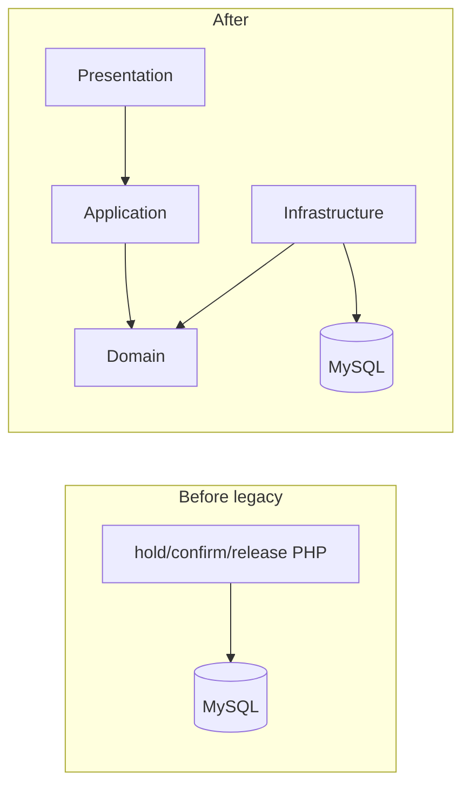

# ticket-hold-legacy-replace

興行チケットの **仮押さえ → 本確定／期限切れ解放** と **二重確保拒否** を、意図的レガシーから DG-AIDLC でドメイン抽出する Brownfield 作品。

Greenfield の対照は [`salon-booking-ddd`](../salon-booking-ddd)。本作は **別ドメインで型が横展開できること** の証明。主役は [`aidlc-docs/`](aidlc-docs/README.md)。

> 設計判断の詳細・承認ゲートは [`aidlc-docs/`](aidlc-docs/README.md) を参照。

## ① 概要

| フェーズ | パス | 状態（2026-07-24） |
|----------|------|-------------------|
| Before | `legacy/` | 動作確認済（意図的負債込み） |
| After | `src/Domain/` + `tests/Unit/` | Domain Green + 境界検証済 |
| プロセス | `aidlc-docs/` | Step 1–7 済（Domain 抽出区切り） |

スコープ（v1）: 仮押さえ作成 / 本確定 / 期限切れ解放 / 二重確保拒否。決済・会員・検索 UI 等は入れない。

Application / Infrastructure / After デモ UI は Intent Done の残り（[`decision-log.md`](aidlc-docs/decision-log.md) 参照）。

## ② 使用技術（現状）

| 層 | 選択 |
|----|------|
| Before | PHP 8.3 + mysqli + Apache（compose） |
| After | PHP 8.3（素の PHP）+ PHPUnit 11 + Composer |
| DB | MySQL 8 |
| DX | Makefile + docker compose（`php` サービスで test / analyse） |
| 境界検証 | Deptrac 3 + PHPStan 2（`make check`） |

## ③ アーキテクチャ

Before は画面ごと PHP。After は Domain / Application / Infrastructure へ抽出する（**Domain と品質ゲートまで完了**）。



レイヤ分離は Deptrac で逆流を検知する（Domain が Infrastructure を import しない等）。

## ④ 設計上の工夫

- Brownfield: 意図的負債を計画 → `legacy/` → Reverse Engineering → ドメイン抽出
- Never Vibe Code: Step 1–3 の questions 承認後に Red → Green
- 受入例示 H/C/R/Q と Domain Unit が 1:1（17 ケース）
- レガシー D5（仮押さえ上書き）等は Domain の二重拒否で解消方向（[`anti-patterns.md`](aidlc-docs/inception/reverse-engineering/anti-patterns.md)）

## ⑤ ローカル起動方法

```bash
make setup
```

Legacy UI: http://localhost:8080/

After（品質ゲート）:

```bash
make composer-install
make check    # test + phpstan + deptrac
```

## ⑥ 動作確認

### Before（`legacy/`）

1. 空席で「仮押さえ(A)」→ status が `hold`、`hold_until` が入る
2. 「本確定(A)」→ status が `OK`（レガシーのゆれた確定語）
3. 別購入者の「仮押さえ(B)」を同じ席に重ねると上書きできる（意図的穴 D5）
4. 「期限切れ解放を実行」で期限超過の hold を `free` に戻せる

### After（Domain）

`make check` で以下を一括確認:

- PHPUnit 17 件（受入 H/C/R/Q）
- PHPStan level 6（`src/`）
- Deptrac violations 0

## ⑦ ディレクトリ構成

```text
ticket-hold-legacy-replace/
├── aidlc-docs/           # 設計・判断・受入（主役）
├── legacy/               # Before
├── src/Domain/           # After ドメイン
├── tests/Unit/Domain/    # 受入 H/C/R/Q（1:1）
├── adapters/
├── Makefile
├── deptrac.yaml
├── phpstan.neon
├── composer.json
└── docker-compose.yml
```

## ⑧ 今後の拡張案

- Application / Infrastructure / Seeder（`make setup` で After デモ）
- 同時書き込み Feature（DB 防衛・Intent Q7）

## AI 駆動開発（事実）

- DG-AIDLC キット配置。Step 1–3 は `*-questions.md` を正本として承認（2026-07-23〜24）
- Inception で Reverse Engineering 済みのうえ Construction（Red → Green → Refactor）
- Step 1 で AI 草案の Laravel 案を却下し素の PHP + Deptrac を選択
- Step 4–7: 受入表どおり Red → Green → `make check` → decision-log / README で区切りを記録（2026-07-24）
- 詳細: [`aidlc-docs/`](aidlc-docs/README.md)、[`decision-log.md`](aidlc-docs/decision-log.md)
