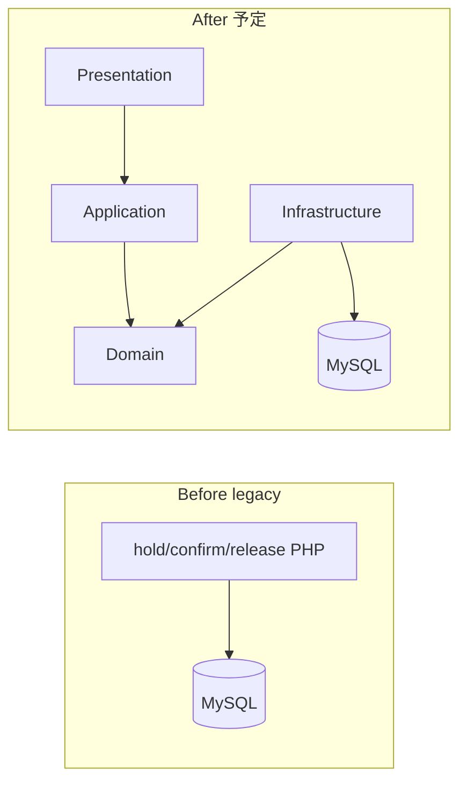

# ticket-hold-legacy-replace

興行チケットの **仮押さえ → 本確定／期限切れ解放** と **二重確保拒否** を、意図的レガシーから DG-AIDLC でドメイン抽出する Brownfield 作品。

Greenfield の対照は [`salon-booking-ddd`](../salon-booking-ddd)。本作は **別ドメインで型が横展開できること** の証明。主役は [`aidlc-docs/`](aidlc-docs/README.md)。

> 設計判断の詳細・承認ゲートは [`aidlc-docs/`](aidlc-docs/README.md) を参照。

## ① 概要

| フェーズ | パス | 状態（2026-07-23） |
|----------|------|-------------------|
| Before | `legacy/` | 動作確認済（意図的負債込み） |
| After | （未配置） | Step 2–3 承認後に素の PHP + Domain 境界で実装 |
| プロセス | `aidlc-docs/` | Step 1–2 承認済 → Step 3 未承認 |

スコープ（v1）: 仮押さえ作成 / 本確定 / 期限切れ解放 / 二重確保拒否。決済・会員・検索 UI 等は入れない。

## ② 使用技術（現状）

| 層 | 選択 |
|----|------|
| Before | PHP 8.3 + mysqli + Apache（compose） |
| DB | MySQL 8 |
| DX | Makefile + docker compose |
| After / 境界検証 | Step 1 で確定（Deptrac / PHPStan 等） |

## ③ アーキテクチャ（予定）

Before は画面ごと PHP。After は Intent 承認後に Domain / Application / Infrastructure へ抽出する。



## ④ 設計上の工夫

- Brownfield: 意図的負債を `intentional-debt-plan.md` に計画してから `legacy/` に埋め、Reverse Engineering で復元する
- Never Vibe Code: Step 1–3 の questions 承認前に After / Red に入らない
- 受入例示とテストは 1:1（Step 3 以降）

意図的負債の例（Before）: グローバル `$conn`、状態語のゆれ、期限チェックの抜け、仮押さえ同士の二重を許す穴。詳細は `aidlc-docs/inception/intentional-debt-plan.md`。

## ⑤ ローカル起動方法

```bash
make setup
```

Legacy UI: http://localhost:8080/

## ⑥ 動作確認（Before）

1. 空席で「仮押さえ(A)」→ status が `hold`、`hold_until` が入る
2. 「本確定(A)」→ status が `OK`（レガシーのゆれた確定語）
3. 別購入者の「仮押さえ(B)」を同じ席に重ねると上書きできる（意図的穴 D5）
4. 「期限切れ解放を実行」で期限超過の hold を `free` に戻せる

## ⑦ ディレクトリ構成

```text
ticket-hold-legacy-replace/
├── aidlc-docs/           # 設計・判断・受入（主役）
├── legacy/               # Before
├── adapters/             # DG-AIDLC スタックメモ
├── .cursor/rules/        # dg-aidlc / ai-dlc-workflow
├── .aidlc-rule-details/
├── Makefile
└── docker-compose.yml
```

## ⑧ 今後の拡張案

- Reverse Engineering → Step 2–3 → After（Red/Green/境界検証）
- 同時リクエストの明示デモ用シナリオ

## AI 駆動開発（事実）

- キット `dg-aidlc` を配置し、Step 1 questions を正本として Intent を進める（2026-07-23）
- 詳細は [`aidlc-docs/`](aidlc-docs/README.md) と [`decision-log.md`](aidlc-docs/decision-log.md)
