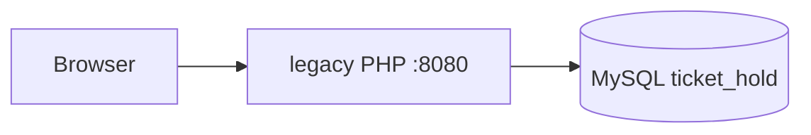
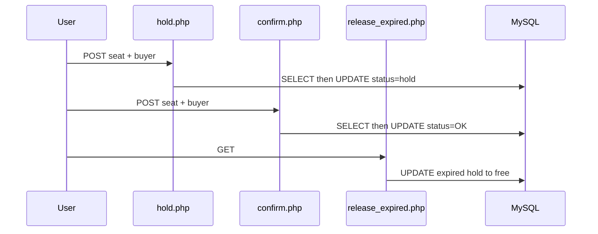

# System Architecture（legacy Before）

## Overview

単一 Apache コンテナが `legacy/public` を配信し、MySQL の `seat_rows` を直接更新する。レイヤ分離なし。

## Components

| コンポーネント | 役割 |
|----------------|------|
| `legacy` サービス | PHP 8.3 + Apache + mysqli |
| `db` サービス | MySQL 8。`init.sql` で seed |
| Makefile | `make setup` / `up` / `down` |

## Key flows

## After（予定・Intent）

Presentation → Application → Domain。Infrastructure が MySQL。Deptrac で Domain → FW 依存ゼロを証明。
